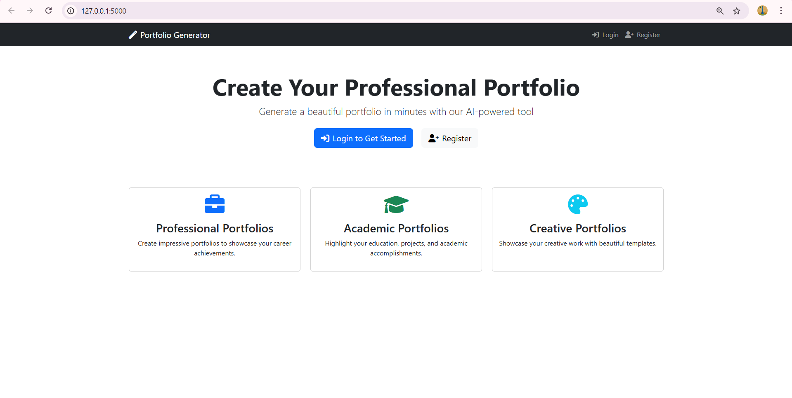
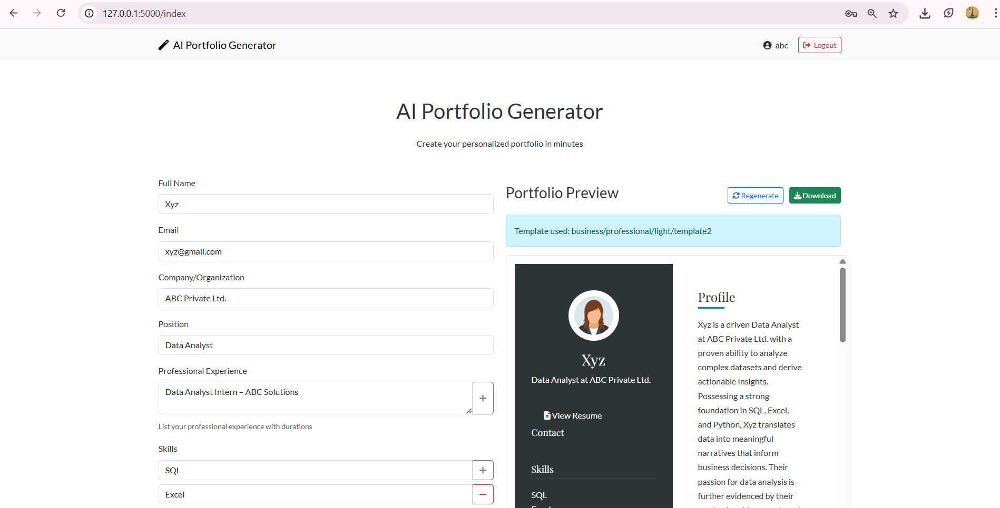
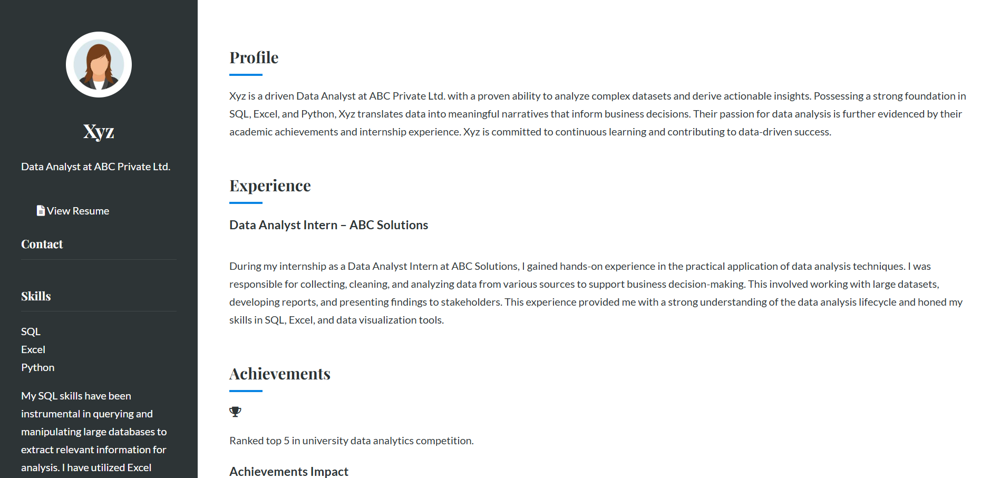

# 🧠 GenFolio – Personalized Creative Portfolio Generator using Generative AI

GenFolio is a smart, AI-powered web application designed to help users create customized and visually appealing portfolios effortlessly. Whether you're a student, professional, or creative, this tool helps generate tailored portfolios with just a few inputs.

---

## 🔍 Project Overview

GenFolio simplifies portfolio creation by allowing users to:
- Register/login securely.
- Fill out dynamic forms with details like name, position, experience, skills, and more.
- Choose from professional, academic, or creative portfolio templates.
- Instantly preview and download polished portfolios using AI-generated content and templates.

---

## 💡 Features

- 🖥️ **Responsive UI** built using HTML, CSS, and Bootstrap.
- 🤖 **AI Content Generation** for personalized descriptions and summaries.
- 📄 **Downloadable Portfolio** in professional formats.
- 🔐 **Authentication System** for login and registration.

---

## 📸 Screenshots

### 🔐 Home Page – Portfolio Generator Landing

This is the landing page of the application where users can log in or register and select the type of portfolio they want to build:



---

### 📊 Abstract Poster Display

This shows a poster-style overview used in academic presentations to describe the GenFolio system's concept and uniqueness:



---

### 🧾 Portfolio Generator Interface

Here, users fill out their information, and a live preview of the generated portfolio appears on the right:



---

## 🛠️ Tech Stack

- **Frontend:** HTML, CSS, Bootstrap
- **Backend:** Flask (Python)
- **AI Integration:** Gemini Pro API (for content generation)
- **Database:** SQLite (for storing user data)

---

## 📁 How to Run Locally

1. Clone the repository:
   ```bash
   git clone https://github.com/your-username/genfolio.git
   cd genfolio
2. Set up a virtual environment:
   ```bash
   python -m venv venv
   source venv/bin/activate  # or venv\Scripts\activate on Windows
3. Install dependencies:
   ```bash
   pip install -r requirements.txt
4. Run the Flask app:
   ```bash
   python app.py
5. Open in browser:
   ```bash
   http://127.0.0.1:5000/


---

Let me know if you'd like me to export this as a downloadable `README.md` file for you.


